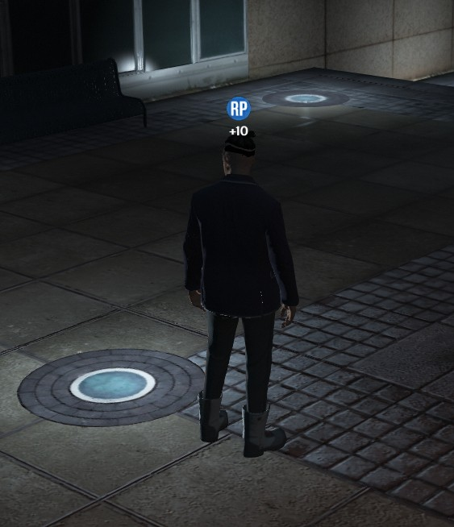

## XanderWP Icon above the head system [Standalone]

A simple script that will allow you to display an icon with text above the player's head (or NPC)

### [Discord](https://discord.gg/gbwDMUJ2H8)

### [Donations](https://ko-fi.com/xanderwp)

### [Tebex](https://xander-fivem.tebex.io/)

# Use script example

`LUA`

```LUA
-- Client
local amount = 10
local iconType = 'rp' -- 'rp' | 'cash' | 'ammo'
local ms = 1500
local target = GetPlayerPed(-1)
TriggerEvent('showIconUnderhead', amount, iconType, ms, target)
```

`JavaScript`

```JS
// Client
const amount = 10
const iconType = 'rp' // 'rp' | 'cash' | 'ammo'
const ms = 1500
const target = GetPlayerPed(-1)
emit('showIconUnderhead', amount, iconType, ms, target)
```

# Example


